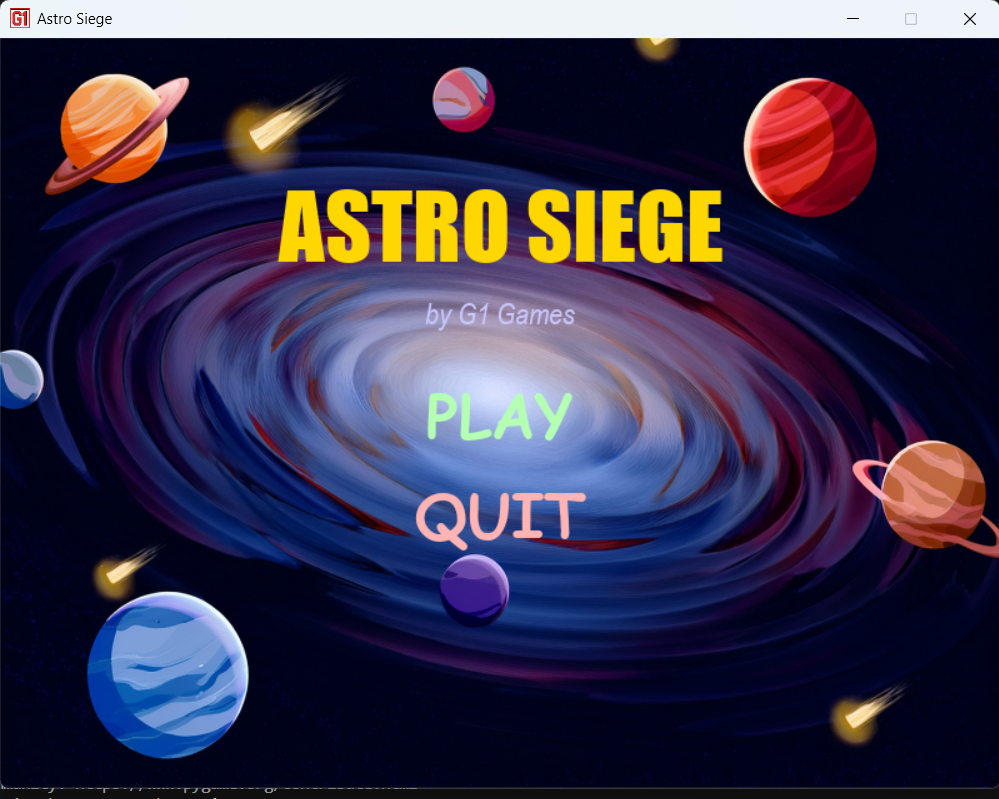
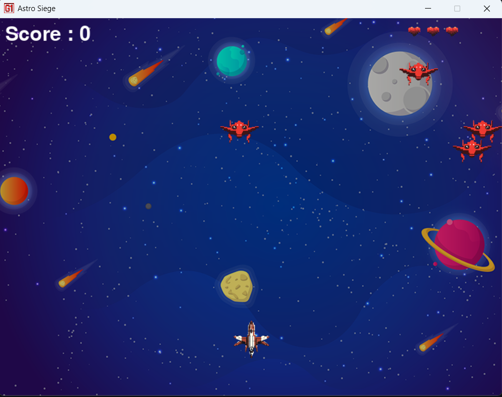
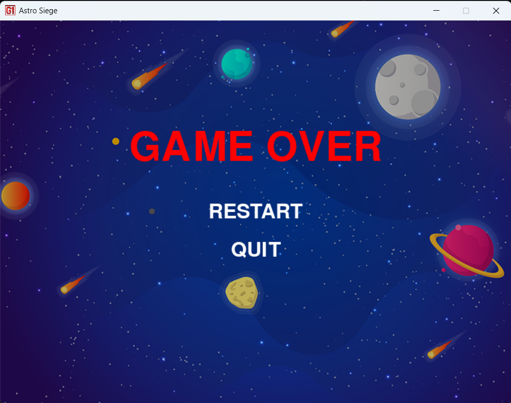

# 🚀 Astro Siege

**Astro Siege** is a 2D space shooter game made with **Python** and **Pygame**. Players control a spaceship, shoot enemies, and survive incoming alien attacks while enjoying stylized graphics and sound.

## 🎮 Features

- Player-controlled space ship with smooth movement  
- Firing bullets to destroy enemies  
- Multiple enemies with random motion  
- Score tracking and life system with heart icons  
- Game over screen with restart and quit options  
- Stylized menu screen with background and hover effects  
- Background music and sound effects

## 🖼 Screenshots




## 🛠 Requirements

- Python 3.x  
- Pygame
  
## 🚀 HOW TO RUN

Install dependencies:
```bash
pip install pygame
python main.py

